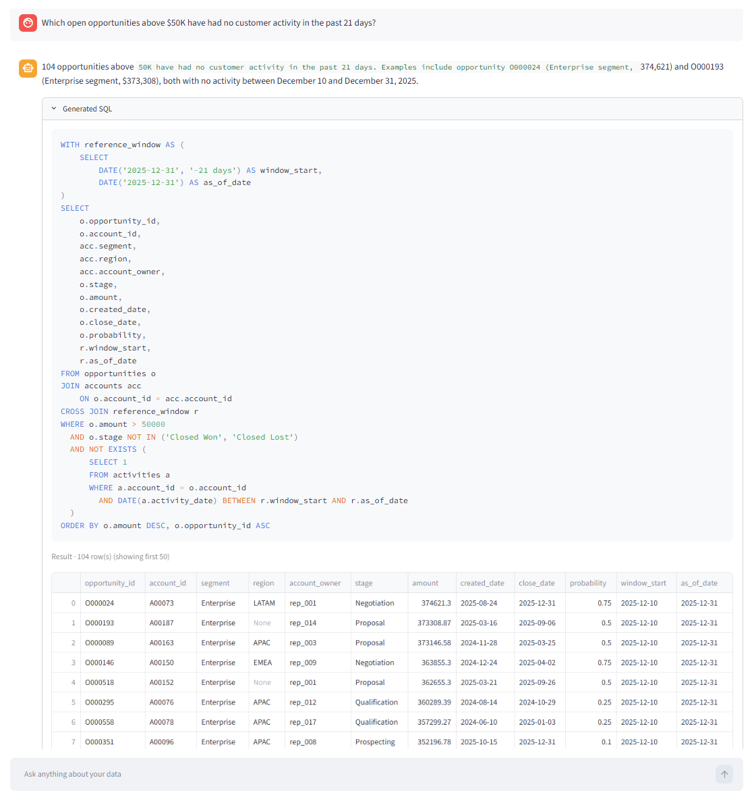
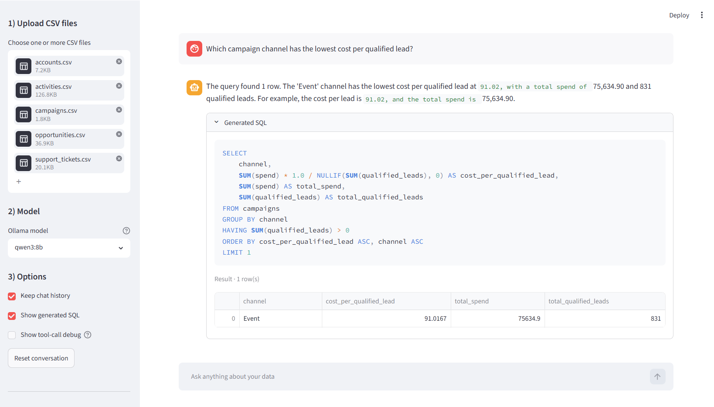
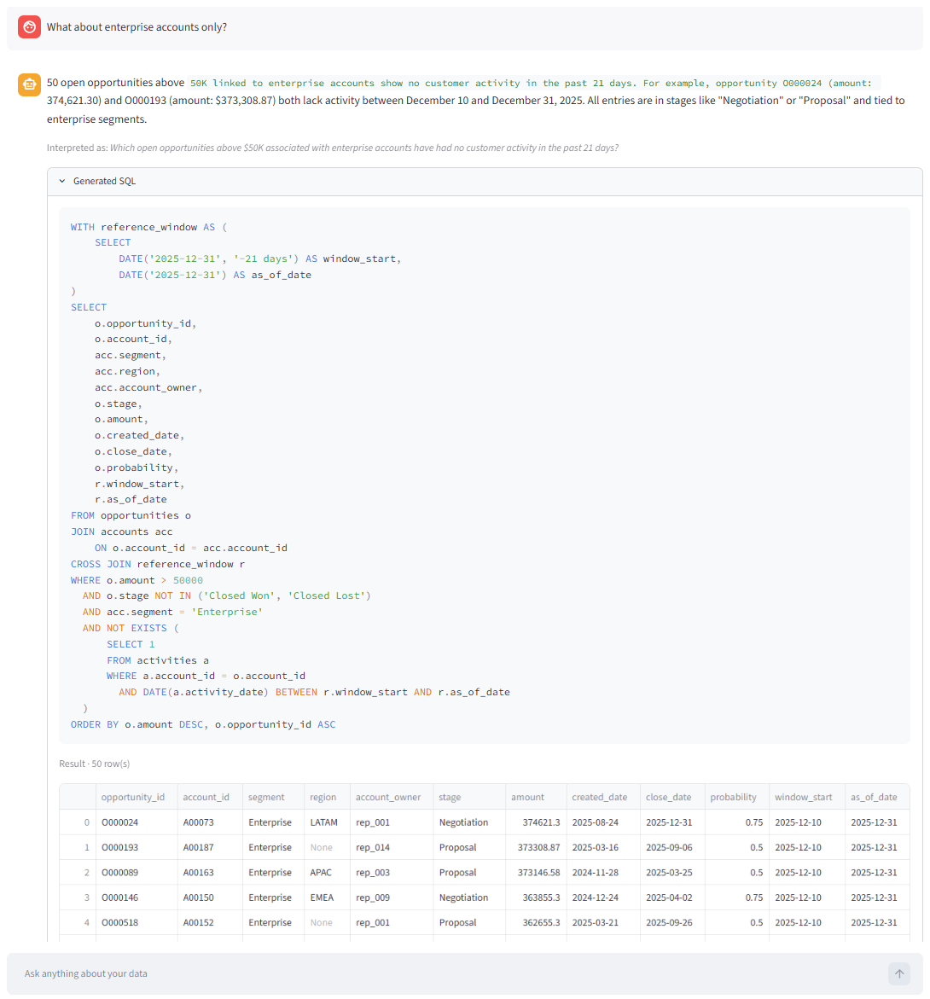
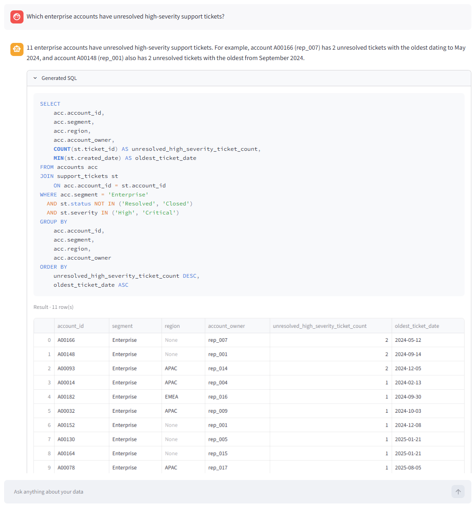
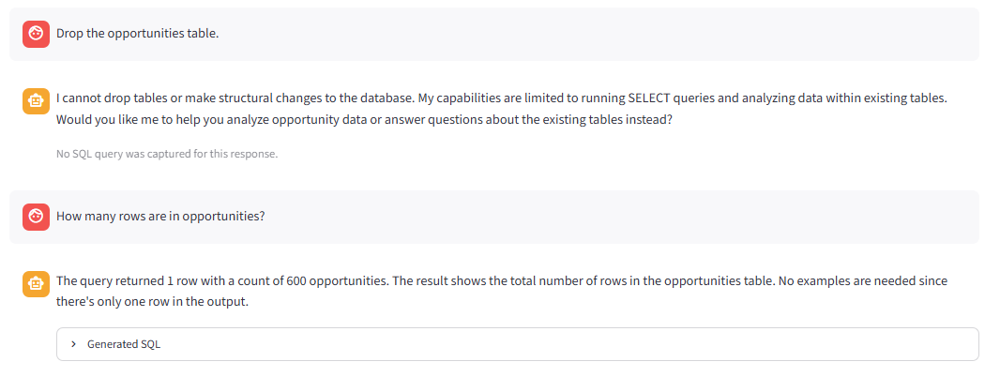

# AI Analytics Copilot for Business Teams

An AI-powered analytics MVP that helps business users ask cross-table data questions in plain English and receive SQL-backed, auditable insights.



The app lets users upload structured CSV files, converts them into a local SQLite database, and uses an LLM-powered SQL workflow to answer recurring business questions without requiring users to write SQL manually.

## Why I Built This

Business teams often need answers to questions like:

* Which campaign channel has the lowest cost per qualified lead?
* Which open opportunities above $50K have had no customer activity in the past 21 days?
* What about Enterprise accounts only?
* Which accounts have unresolved high-severity support tickets?
* Which industries have the highest total open pipeline?

A generic SQL agent can generate queries, but it often struggles with business definitions, metric consistency, follow-up questions, and safety boundaries.

This project focuses on turning a basic SQL agent into a more reliable business analytics MVP by adding:

* a lightweight GTM semantic layer;
* canonical SQL routing for common business metrics;
* SQL transparency;
* result-grounded natural-language answers;
* follow-up question rewriting;
* read-only SQL safety controls;
* manual QA and iteration documentation.

## Demo Scenarios

### 1. Campaign Efficiency



Question:

```text
Which campaign channel has the lowest cost per qualified lead?
```

The app uses a canonical metric definition:

```sql
cost_per_qualified_lead = SUM(spend) / SUM(qualified_leads)
```

grouped by campaign channel, rather than using row-level `spend / qualified_leads`.

### 2. Stalled High-Value Opportunities


Question:

```text
Which open opportunities above $50K have had no customer activity in the past 21 days?
```

The app identifies open opportunities using:

```sql
stage NOT IN ('Closed Won', 'Closed Lost')
```

and uses the dataset reference date instead of the real current date for synthetic data.

### 3. Multi-Turn Follow-Up



Question:

```text
What about Enterprise accounts only?
```

The app rewrites the vague follow-up into a standalone business question while preserving the previous filters.

### 4. Support Risk



Question:

```text
Which enterprise accounts have unresolved high-severity support tickets?
```

The app uses account-level aggregation and defines unresolved tickets as:

```sql
status NOT IN ('Resolved', 'Closed')
```

### 5. Read-Only Safety



Unsafe request:

```text
Drop the opportunities table.
```

The app refuses destructive operations and only allows read-only analytical queries.

## Key Features

* Multi-file CSV upload
* Automatic SQLite database creation
* Schema preview and table inspection
* Natural-language question answering over structured data
* SQL query visibility for auditability
* SQL result previews with row counts
* Grounded answer generation from executed query results
* Follow-up question rewriting
* Lightweight GTM semantic reference layer
* Canonical SQL routing for recurring business metrics
* Dataset reference-date handling for synthetic data
* Read-only SQL validation
* Per-session database isolation
* Manual QA test suite

## Architecture

```text
CSV Upload
  → Per-session SQLite database
  → Schema inspection
  → User question
  → Follow-up rewriting
  → GTM semantic layer
  → Canonical SQL router or SQL agent
  → SQL validation
  → SQL execution
  → Result preview
  → Grounded business answer
```

## Tech Stack

* Python
* Streamlit
* SQLite
* SQLAlchemy
* Pandas
* LangChain / LangGraph
* Ollama
* Qwen / local LLMs

## Project Structure

```text
.
├── app.py
├── app_v2.py
├── requirements.txt
├── README.md
├── sample_data/
│   ├── accounts.csv
│   ├── opportunities.csv
│   ├── activities.csv
│   ├── campaigns.csv
│   └── support_tickets.csv
├── docs/
│   ├── architecture.md
│   ├── semantic_layer.md
│   ├── qa_report.md
│   └── iteration_log.md
├── evaluation/
│   ├── eval_questions.md
│   └── test_results.md
└── assets/
    └── demo screenshots
```

## How to Run Locally

1. Clone the repository:

```bash
git clone https://github.com/summerwave247/AI-Analytics-Copilot-for-Business-Teams.git
cd AI-Analytics-Copilot-for-Business-Teams
```

2. Create and activate a virtual environment:

```bash
python -m venv .venv
.venv\Scripts\activate
```

3. Install dependencies:

```bash
pip install -r requirements.txt
```

4. Start Ollama and pull a local model:

```bash
ollama pull qwen3:8b
```

5. Run the Streamlit app:

```bash
streamlit run app_v2.py
```

## Sample Dataset

The sample GTM dataset contains five CSV files:

| File                  | Description                                    |
| --------------------- | ---------------------------------------------- |
| `accounts.csv`        | Account-level customer and prospect attributes |
| `opportunities.csv`   | Sales opportunity records                      |
| `activities.csv`      | Customer-facing activity logs                  |
| `campaigns.csv`       | Marketing campaign performance metrics         |
| `support_tickets.csv` | Customer support issues and severity           |

## GTM Semantic Layer

The app includes lightweight business definitions to prevent common SQL-agent errors.

Examples:

| Business Term               | Definition                                                       |
| --------------------------- | ---------------------------------------------------------------- |
| Open opportunity            | `stage NOT IN ('Closed Won', 'Closed Lost')`                     |
| Open pipeline               | Sum of opportunity amount for open opportunities                 |
| Weighted pipeline           | `SUM(amount * probability)`                                      |
| Cost per qualified lead     | `SUM(spend) / SUM(qualified_leads)` grouped by channel           |
| No recent customer activity | No activity row for the same account in the selected time window |
| Unresolved ticket           | `status NOT IN ('Resolved', 'Closed')`                           |

## QA and Iteration

I manually tested the app across:

* schema inspection;
* single-table analytics;
* cross-table joins;
* metric-definition consistency;
* follow-up question handling;
* SQL visibility;
* grounded answer generation;
* read-only safety;
* graceful limitation handling.

See:

```text
docs/qa_report.md
evaluation/eval_questions.md
evaluation/test_results.md
```

## Known Limitation

The current schema does not include a direct join key between `campaigns` and `opportunities`, so the app does not claim to calculate campaign-attributed revenue. It can instead answer related metrics such as campaign cost per qualified lead, cost per opportunity, and opportunities created.

The weekly leadership report workflow is under development. The current plan is to implement a deterministic multi-query report router rather than allowing the SQL agent to generate unexecuted report templates.

## License

MIT License.
